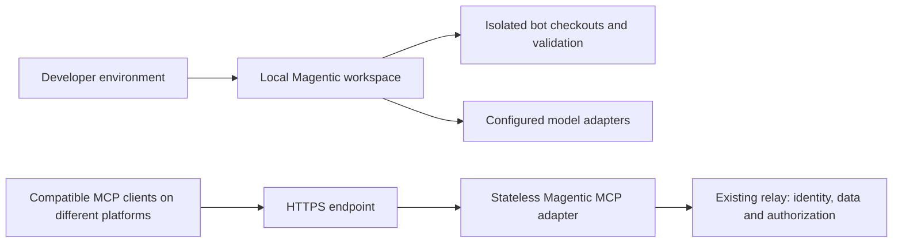

# Deployment and stack decision

Magentic uses the Anthropic/OpenAI API track described in the supplied build
brief as its product direction. Keep the existing TypeScript, Node 22, zod and
MCP SDK foundation. Model providers remain adapters; Ollama stays available for
local work. A model selector does not establish that a provider is connected.
The browser UI stays in TypeScript and CSS; the installable shell is a separate
packaging step. No framework migration is needed to demonstrate this workflow.

## Two deployment boundaries



The local workbench owns its local session, project files and supervised bot
execution. It is not a multi-user cloud service. Do not expose the development
watcher or forward its bootstrap cookie to public clients.

The existing `dist/http-main.mjs` is the standalone hosted adapter. It accepts
each caller's relay credential and forwards authorized requests to the existing
LNKZ/LLMM relay. This deployment does not host the workflow UI, desktop bot
timeline or Jira review routes. Shared workflow storage and remote coding
workers require their own authorization and persistence design.

## Run the adapter container

Docker Engine and Compose are prerequisites. From the repository root:

```sh
export LNKZ_BASE_URL=https://your-relay.example.com
docker compose -f deploy/compose.yaml config --quiet
docker compose -f deploy/compose.yaml up --build -d
curl --fail http://127.0.0.1:8080/health
docker compose -f deploy/compose.yaml logs --tail=50 mcp
```

In PowerShell set `$env:LNKZ_BASE_URL` instead of using `export`.
Use a relay you operate or are authorized to access. The template starts with
read-only MCP scopes and binds the host port to loopback. Each client supplies
its own credential. Do not set a shared `LNKZ_API_KEY` on the hosted adapter.
The health probe checks process liveness, not relay availability or a successful
authenticated tool call. Verify those separately with an authorized test user.

No local workspace data is copied into the image. The image serves the bundled
file catalog by default. To serve an approved workspace registry, deliberately
mount a reviewed registry snapshot and workflow file read-only, set
`MAGENTIC_REGISTRY_DIR`, `MAGENTIC_WORKSPACE` and `MAGENTIC_WORKFLOW_FILE`, and
roll out the same snapshot to every replica. Catalog loading happens at startup;
a changed snapshot needs a restart. Do not share the desktop's writable JSON
store between replicas.

## AWS path

Use one EC2 Linux instance with Docker for an initial deployment when operating
an instance is part of the learning goal. Use an instance role and Systems
Manager for administration; keep the initial Compose listener private. Access
it through an authorized port-forwarding session while verifying the adapter.
This configuration does not provision AWS resources or create a public URL.

For a public endpoint, place a TLS reverse proxy or an HTTPS Application Load
Balancer in front. If using an ALB, change the host listener to the instance's
private interface and allow its application port only from the ALB security
group. Do not expose port 8080 directly to the internet. Test the caller's
authentication, origin handling and client compatibility before publication.
The current adapter uses relay bearer credentials; it does not implement a full
MCP OAuth discovery flow, so do not claim universal hosted-client compatibility.

Build and tag the same image for ECR and ECS when deployment is repeatable.
ECS with Fargate removes EC2 host management. Select EC2 when host customization
or dedicated worker requirements justify that operational work. Choose CPU and
memory from measurements; the Compose limits are an initial development budget,
not a capacity or performance claim. Keep LLM inference out of the MCP adapter.

The adapter can be replicated because request state stays in the relay. The
relay itself must have a compatible durable store and authentication setup;
replicating this adapter does not make a file-backed relay highly available.
Run a real authenticated MCP request on two replicas before claiming scale-out.

## Optimize the workflow first

- Bound model calls, context and tool calls per phase; use deterministic checks
  for validation. Select models from measured task quality and latency.
- Store versioned evidence and idempotency keys; keep approval hashes across
  handoffs. Never automatically retry an uncertain external write.
- Keep Foundry or Databricks as optional integrations when a project's data
  needs justify them. Magentic itself need not depend on either platform.
- Treat web, mobile, data/AI and automation starters as editable task briefs.
  They do not install a stack, run bots, fetch datasets or grant new permissions.

References: [AWS Fargate](https://docs.aws.amazon.com/AmazonECS/latest/developerguide/AWS_Fargate.html),
[MCP authorization](https://modelcontextprotocol.io/specification/2025-11-25/basic/authorization),
[OpenAI MCP tools](https://developers.openai.com/api/docs/guides/tools-connectors-mcp).
