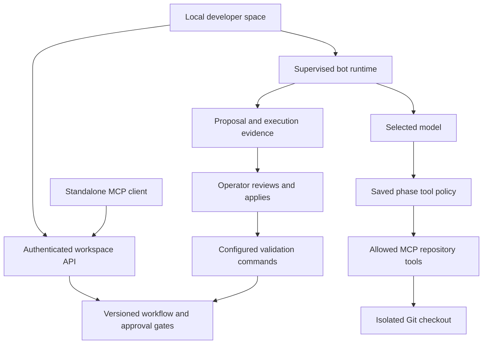

# MCP workflow architecture and verification

Magentic is being built as an installed developer workspace. Desktop packaging
is deferred while the MCP and workflow layers are completed. The loopback UI
is the development and verification surface; public browser access is not part
of this milestone.

## Layers and ownership

| Layer | Implementation | Current boundary |
| --- | --- | --- |
| Workspace identity | `local-session.ts`, `workspace-directory.ts`, `server.ts` | Local owner, temporary UI session, workspace-bound MCP credentials. No multiuser enrollment. |
| Definition registry | `../registry/` | Configurable states and roles; approvals bind to the current content hash. |
| Workflow engine | `pipeline.ts`, `storage.ts` | Versioned stage assignments, saved runs, evidence, distinct approvals, pause, retry, cancellation. |
| Bot policy | `bot-schema.ts` | Kind, model-call limit, timeout, repository tool allowlist and MCP-call limit per phase. |
| Repository execution | `bot-project.ts`, `bot-worker.ts`, `bot-runtime.ts` | Isolated Git worktrees; bounded model/tool loop; explicit proposal application, validation and handoff. |
| Standalone MCP | `mcp-portal.ts`, `pipeline-mcp.ts`, `bot-mcp.ts` | Approved definitions, workflow commands, capabilities and scoped bot evidence. |
| Model adapters | `chat-config.ts`, `model-catalog.ts` | Local Ollama and configured cloud providers. Availability depends on the actual adapter and credentials. |
| Developer space | `desk-view.ts`, `pipeline-view.ts`, `bot-view.ts`, `browser.ts` | Task composer, saved sessions, review queue, bot timeline, changes and checks. |
| External automation | `pipeline.ts` Jira previews; LNKZ REST boundary | Jira and email delivery are not live. External connectors and conversation storage remain owned by LNKZ. |

The workspace store owns Magentic's run and configuration records. It does not
replace the relay's conversation store or authentication system.

## Execution path



Starting a session does not start a model automatically. The operator starts
the active phase's bot, reviews its proposal, applies changes, runs checks, and
submits the result. An AI review is not an independent human approval. Run
owners and output authors cannot approve their own gated handoffs.

## Phase tool controls

A stage may include this bot policy:

```json
{
  "kind": "coder",
  "maxSteps": 6,
  "timeoutSeconds": 120,
  "allowedTools": ["list_project_files", "read_project_file"],
  "maxToolCalls": 3
}
```

Only three repository tools are currently supported: `list_project_files`,
`read_project_file`, and `project_diff`. These are real MCP SDK tools linked
inside the worker. This is not yet a general external MCP-server marketplace.

- Missing `allowedTools` preserves the three tools used by older bot phases.
- An empty list gives the model only the work item and prior handoff context.
- Missing `maxToolCalls` preserves the old maximum of `maxSteps - 1` calls.
- An explicit limit accepts 0–11 calls. The effective limit also reserves the
  final model call for a result; it cannot exceed `maxSteps - 1`.
- Disallowed tools are not registered and calls are refused before dispatch.
  The policy and audit checks do not depend on the model following its prompt.
- A coding proposal must follow a successful read of that exact path. Removing
  `read_project_file` therefore prevents file proposals, even for a coding bot.
- New configuration versions affect new runs. Existing runs and attempts retain
  their saved tool policy; applying a bot template preserves custom restrictions.

Repository tools cannot run commands. Owner-configured validation commands run
only on request, with the user's OS account. Worktree isolation is not an OS
sandbox. Selected source content reaches the selected provider; local Ollama is
the option for keeping model input local.

## MCP surfaces

All workspace endpoints derive identity and workspace scope from authentication.
Clients cannot supply an actor or another workspace in tool arguments.

| Surface | Tools | Effect |
| --- | --- | --- |
| `/api/mcp` | `list_approved_agents`, `get_approved_agent`, `get_workspace_policy` | Read definitions and policy; check current signature eligibility. |
| `/api/pipeline-mcp` | `get_pipeline`, `get_pipeline_run` | Read workflow configuration and runs. |
| `/api/pipeline-mcp` | `start_pipeline_run`, `update_pipeline_run` | Record workflow state through the same roles, revisions and approval gates as the UI. |
| With bot runtime enabled | `get_pipeline_capabilities` | Inspect configured phase models, enforced tool policies and execution boundaries. Model configuration does not prove provider availability. |
| With bot runtime enabled | `list_bot_attempts` | Page through metadata for one run; defaults to 20, maximum 50 per page. Source changes are omitted. |
| With bot runtime enabled | `get_bot_attempt` | Read one attempt's saved policy, proposal, checks and log using both run and attempt IDs. |
| With bot runtime enabled | `get_bot_timeline` | Existing full workspace timeline; retained for compatibility. |

Standalone MCP credentials cannot invoke `/api/bots`. Starting a bot, changing
repository files, running validation commands, and accepting a bot result require
the local application session. No inspection tool creates execution authority.

The original stdio and `/mcp/<name>` relay adapter remain separate from these
workspace endpoints. They continue to use the LNKZ REST API.

## Build and automated tests

Use Node 22 and the pinned pnpm 10.26.1 through Corepack, from the repository root:

```sh
corepack pnpm install --frozen-lockfile
corepack pnpm typecheck
corepack pnpm test:mcp
corepack pnpm test
corepack pnpm build
corepack pnpm build:workbench
```

`test:mcp` compiles tests and runs the registry workflow, workspace MCP, pipeline,
bot, tool-policy and local-authentication suites. `test` runs every test. These
tests use temporary files, repositories and local SDK clients; they do not need
model credentials or a running Ollama service. Some optional integration tests
may skip; inspect the final counts rather than treating skipped work as verified.

The root build recreates `dist`, so build the workbench after it. Desktop builds
are not required for MCP development.

## Local development check

For an isolated PowerShell development session:

```powershell
$env:MAGENTIC_WORKSPACES_DIR = Join-Path $env:TEMP 'magentic-development-workspaces'
$env:MAGENTIC_LLM_PROVIDER = 'ollama'
$env:MAGENTIC_LLM_CHAT_MODEL = 'qwen2.5-coder:7b'
$env:MAGENTIC_LLM_BASE_URL = 'http://127.0.0.1:11434'
corepack pnpm local:workbench
```

Open the printed loopback address. Model execution additionally needs Ollama,
the selected downloaded model and the existing optional `@langchain/ollama`
adapter. Automated policy tests do not establish model quality or live provider
availability. Do not use a real project to test deliberately failing commands.

### The documentation portal

Any documentation a person gives the workspace is one record in
`workbench/documents.ts`: stored once by content hash (in memory for the
demo, under `<data>/documents` for the local application), with the
number of lines that looked like a credential counted at add time and
never shown. From that one copy a document connects to the LLM workspace
in two ways, both as the ordinary engine commands run as the person:

- attached to a running workflow as the reference material its stage
  prompts carry (the pipeline's `materials` action, owner or admin, recorded
  on the run's timeline and frozen with the run);
- added to a Model Studio project as a dataset in the recipe's shape, one
  record per paragraph in the document's own wording, validated on the way
  in. Training stays a separate step on the project.

A document with a credential finding is kept so it can be seen and removed,
and refused everywhere it would reach a prompt or a dataset. The Documents
page (`documents-view.ts`) and the pipeline MCP tools `list_documents`,
`add_document` and `connect_document` are the two surfaces; neither returns
the content over MCP.

### Gateways and token accounting

Any OpenAI compatible endpoint can serve models next to Ollama and the named
cloud providers: a local router that pools free tiers, a compression proxy, or
a hosted service. It is configured on the server, never from the browser:

```powershell
$env:MAGENTIC_GATEWAY_BASE_URL = 'http://127.0.0.1:20128'   # https, or http on this machine
$env:MAGENTIC_GATEWAY_MODELS = 'deepseek/deepseek-chat, glm-4'
$env:MAGENTIC_GATEWAY_API_KEY = ''                           # optional; a local gateway usually has none
```

The models appear in the chat selector as `gateway/<name>` and can be named
as a release's base model like any other. Plain http to a host other than
this machine is refused, so a server credential never travels unencrypted.

Every model call records the token counts the provider reported
(`workbench/model-usage.ts` reads Ollama, LangChain, OpenAI and Anthropic
shapes). Counts land on the scheduler job, the bot attempt and the chat
answer, and the home page's Agentic units table sums them per assistant.
Nothing is estimated: a provider that reports nothing shows a dash.

1. Create a workspace and attach a disposable, committed Git repository.
2. Configure phase bots, models, allowed tools and validation commands.
3. Start a session. Run a bot and inspect its actual MCP events and proposal.
4. Review and apply the proposal; run a known validation command. A failed
   configured check must prevent accepting a coding or validation result.
5. Start a new run with a restricted tool policy. A requested forbidden call
   must fail without dispatch and without advancing the phase.
6. Prepare standalone MCP access from the workspace settings. Keep the token
   file private; inspect capabilities and a run's attempts with an SDK client.
7. Restart and verify the same run, policy and evidence remain. Unfinished bot
   attempts recover as interrupted rather than being silently retried.

## Remaining layers before a complete product

1. Structured handoff artifacts and input/output contracts between phases.
2. Independent reviewer enrollment. The single local owner currently stops at
   gates requiring another person; those gates must not be bypassed for a demo.
3. Permissioned external MCP connectors and live Jira actions through LNKZ,
   including idempotency and reconciliation of uncertain write outcomes.
4. Provider-reported token usage, cost accounting and richer failure diagnostics.
   Current model-call counts and check exit codes are measured; tokens and cost
   remain unavailable.
5. Durable background scheduling and recovery for unattended multi-agent work.
   Current runs are supervised, and failed or cancelled bots never auto-advance.
6. A fully bundled desktop shell, installer lifecycle and updates. Browser access
   remains a later product phase.


## Jira actions

`jira.ts` owns payload validation and the adapter HTTP conversation.
`jira-actions.ts` owns durability and authorization. `jira-runtime.ts` provides
reviewed commands and inspection to the local server; `jira-mcp.ts` exposes
only inspection to standalone MCP clients.

```
workflow event -> intent -> authorization -> pending -> claim -> attempt -> outcome -> evidence
```

**Callers send references, never payloads.** A delivery request names a run, an
event and an operation. The server reads the stored event and preview, checks
that the preview belongs to the run and the run to the caller's workspace, and
builds the intent from what is on disk. An object arriving with `authorizedBy`
and `intentHash` on it is ignored; those fields are produced here or not at all.

**Authorization covers the destination.** The hash spans the payload and the
site origin, so moving an authorized comment to another Jira is a different
action and is refused before the request leaves.

**Two commits, on purpose.** The pending action is committed before the claim.
A process that dies between them leaves an action that never went anywhere. A
process that dies after the claim leaves a claim, which on reload is a known
interrupted attempt rather than a mystery.

**Three outcomes, not two.** `uncertain` means a request left and no usable
answer returned: a timeout, an unparseable body, a transport throw. The local
API never retries these actions. Creation and comments embed
`[magentic:<actionId>]`; field updates and transitions do not. The legacy
marker-search helper is not exposed: a missing search result alone cannot
prove a write failed, and different operations need different confirmation.

**Operations mean what they say.** `create_issue` posts an issue.
`add_comment` posts a comment. `update_fields` PUTs a closed list of fields
(summary, description, labels, duedate) and nothing else. `transition_issue`
discovers valid transitions and posts the matching id, never a status name.
The adapter returns discovery as a completed step, so an ordinary failed
transition can reuse it. Steps become durable with the attempt outcome, not
after each individual HTTP request; interrupted attempts stay uncertain.

The preview vocabulary is unchanged: the engine still emits `create_issue` and
`update_issue`, and `update_issue` maps to the `add_comment` operation.

**Storage.** Actions live in the workspace document under `jiraActions`,
optional with a default so workspaces written before this feature still load.
The storage version did not change. Coherence checks refuse a document where a
sent action has no evidence, an unsent action carries evidence, two actions
share an id or dedupe key, an intent hash or dedupe key no longer matches,
a claim disagrees with its status, or an action belongs to another workspace.
Intents use the strict operation schema on disk as well as at authorization.
Pipeline commits preserve current Jira actions; delivery commits reread the
action list after awaiting the adapter, so overlapping attempts cannot erase
each other. This depends on the local store's single-writer lock and synchronous
commits; a future database adapter will need transactional equivalents.

**Defaults and credentials.** Preview mode is the default and performs no
network writes; its site origin is `https://preview.invalid`, which can never
equal a configured site, so a preview-authorized action cannot be delivered
live without fresh authorization. All three settings go through `setting()`:
`MAGENTIC_JIRA_URL`, `MAGENTIC_JIRA_EMAIL`, `MAGENTIC_JIRA_API_TOKEN`. Partial
configuration throws and names the missing settings. Requests use
`redirect: "error"` so the Authorization header cannot follow a redirect to
another host.

### Local API and standalone inspection

The local session can call `POST /api/jira` with `action: "preview"`, `runId`,
`eventId`, and optionally `operation` and closed `fields`. The response contains
an intent and `expectedIntentHash`; preview does not persist authorization.
To submit exactly that reviewed intent, post the same references and fields
with `action: "deliver"` and that hash. A changed hash returns 409. Unknown
request fields return 400. Both commands require directory admin membership
and a trusted local-session capability; posting a role or actor cannot grant it.

`GET /api/jira?runId=<uuid>&offset=0&limit=20` returns stored actions and evidence,
bounded to 50 per page. Missing or foreign runs are refused. Standalone MCP
exposes the same workspace-scoped inspection as `get_jira_actions` on
`/api/pipeline-mcp`. It has no delivery, retry, or reconciliation tool. Standalone
bearer tokens cannot call the HTTP Jira command route.

The running local application defaults to the preview adapter even when Jira
credentials exist. Submitting in this mode stores a pending action and reports
`dispatched: false`, with no outbound request. An explicit `jiraDelivery` adapter
can be supplied at composition time; tests use an in-process fixture to exercise
confirmed outcomes. There is no UI or environment switch enabling live writes.
The production connector must remain behind LNKZ's authorization boundary.

Pending and retryable actions retain their id and correlation marker. An event
already bound to a different intent cannot reuse its steps or evidence. A 429
records `retryNotBefore`; requests before that time are refused, including after
restart. There is no background retry scheduler. Startup marks abandoned claims
uncertain before listening, and shutdown waits for in-flight outcomes before
closing storage.

### Remaining work

- Connect a production LNKZ-backed adapter. The built-in
  REST adapter remains under test; no live Jira request was used to validate
  this API. Finish response validation, whole-response timeouts and conservative
  handling of ambiguous upstream failures before enabling unattended writes.
- Replace legacy marker-only reconciliation with operation-specific evidence.
  The existing helper is preserved for compatibility but is not exposed by the
  local API or MCP. Never infer a safe retry from an empty search result alone.
- Bind a successfully created issue back to subsequent workflow actions with
  revision checks; current evidence is stored but does not rewrite the run.
- Add attachments with authorized manifests and per-file evidence.
The local workflow UI now exposes Review Jira action and Saved actions &
evidence. Confirmation sends the reviewed hash to the API and does not widen
server permissions. Read-only deployments can inspect evidence but cannot
authorize delivery. Automatic phase-triggered delivery remains unimplemented.

## Live development

`pnpm dev:workbench` runs the local application on loopback port 4317. An
esbuild watcher builds server and browser entries before stopping the previous
backend through IPC. Failed compilations leave the working backend running.
Development output and persistent data stay in the ignored `.magentic-dev`
directory, separate from production bundles and desktop data.

The development browser checks a build revision in the manifest. It reloads
automatically when idle and offers an explicit reload after form editing or
while a dialog is open. Normal builds do not include this watcher. Backend
restarts replace the local session and gracefully interrupt bot work; stored
runs and Jira evidence survive. The watcher does not delete stale writer locks
or enable public hosting, live Jira writes, or new approval permissions.


## Development starters and cloud boundary

The developer desk offers web, mobile, data/AI and automation starters. Selecting
one previews its outcome and acceptance criteria; applying it fills an editable
session brief. Starting still uses the existing pipeline command and snapshots
the workspace's configured stages and policy. A starter does not install tools,
change models, lower approvals or start bot execution. Unsaved desk text stays
in memory across ordinary view refreshes and clears when switching workspaces.

The recommended product stack is the existing TypeScript/Node/MCP foundation,
with configurable AI providers and optional external data platforms. See
[deployment decisions](../deploy/README.md) for the EC2/Compose path and future
ECS option. That image hosts the standalone relay adapter, not the single-user
workbench. Shared workflow hosting and remote coding workers remain separate
future work. No AWS resources are provisioned by these files.


## Specialized workflow agents

`bot-profiles.ts` defines requirements, planning, architecture, implementation,
validation, review and delivery profiles. A profile specializes an existing bot
kind; only implementation uses the coder's file-proposal capability. Selecting
a profile cannot add tools, run commands or bypass a human approval. Optional
profiles preserve older run and attempt formats and the manual default.

Set up workflow agents prepares a configuration draft. The operator reviews
model IDs, tool budgets and approval gates before saving. New runs snapshot
that policy; existing runs retain their original configuration. Custom stages,
instructions, models, Jira mappings and approval flags are preserved.

Profiled results require four named report sections and explicit blockers.
The report is stored with the attempt and bound into its proposal hash. A
blocked result cannot be accepted through the bot runtime. Accepted reports
travel in the existing phase output alongside the attempt and proposal IDs.
The pipeline's independent reviewer gate still applies; an agent's review
cannot count as a human signature. Manual phase output remains available as
an explicit operator handoff under the existing pipeline permissions.

Before invoking a model, the runtime compares prior check evidence for the
same run and checkout with the current tree digest. Only matching results are
included as current command evidence, bounded to three attempts and 2,000
output characters per check. Historical handoff prose is explicitly untrusted.
Validation still requires operator-run checks and a matching tree at handoff.
Reports are model assertions, not proof that tests ran or delivery occurred.

These agents use the existing MCP read tools and bounded execution loop. They
do not add autonomous shell access, deployments, Jira writes, self-training or
an OS sandbox. Delivery prepares a rollout plan and Jira draft; the separate
Jira authorization and evidence path remains responsible for external actions.
The design is informed by NVIDIA's AI agents overview:
https://www.nvidia.com/en-us/glossary/ai-agents/

## Feedback and revised attempts

The local bot API accepts `revisionSource` on the existing `start` command:

```json
{
  "action": "start",
  "runId": "<run UUID>",
  "expectedRevision": 1,
  "requestId": "<new request UUID>",
  "revisionSource": {
    "attemptId": "<previous attempt UUID>",
    "expectedHash": "<previous proposal hash>",
    "feedback": "Address the failing negative-input case and explain the correction."
  }
}
```

This uses the existing local-session authorization and run-owner/admin rules.
The source must belong to the active phase in the same workspace and run.
An empty expected hash is valid only for an attempt that has no proposal hash.
The request ID binds the feedback and source as well as the run and revision.
A revised attempt uses the run's saved model, tool policy, budget and checkout.
It does not grant authority through feedback or edit the pipeline configuration.

The source becomes `superseded` in the same durable write that creates the new
attempt. It remains visible for inspection but cannot be applied, checked or
accepted. Cancelling or failing the replacement does not revive the old result.
The replacement can itself be revised. There is no automatic retry scheduler.

The model sees a bounded snapshot of the previous report, error and proposed
paths, plus up to 2,000 characters of operator feedback. It receives no inherited
file-read authority; it must read the current file before proposing a replacement.
The existing tree-matched check evidence supplies actual validation outcomes.
Checks that modify the source leave no valid tree attestation, even with exit
code zero. They must be rerun against the resulting tree before handoff.

This completes the backend review/revise/validate loop. The current UI has no
feedback action yet. The next UI pass should expose task intent, progress,
feedback and review as the primary flow, with models, tools and budgets under
advanced settings. Standalone MCP can inspect revision links and full attempts;
it gains no execution or authorization tools.

Learning reference: NVIDIA's course separates models, tools and instructions
and combines them in a multi-step report-generation workshop. We apply that
structure to the existing TypeScript agent runtime without adding a framework:
https://developer.nvidia.com/topics/ai/agentic-ai-learning-path/how-to-build-an-ai-agent

## Model Studio

The Model Studio takes a use case from a project to an approved assistant in
chat. It lives in `workbench/studio/` and is wired into the workbench server,
the local application and the demo. Six steps, in a fixed order:

| Step | Record | What makes it done |
| --- | --- | --- |
| Define | `ModelProject` | A project names one built in recipe. |
| Data | `Dataset` | Registered JSONL content validated as `valid`. |
| Train | `TrainingConfig`, `TrainingJob` | A job reports `succeeded` with an artifact. |
| Evaluate | `EvaluationRun` | Every metric meets the recipe threshold and the baseline. |
| Approve | `ModelRelease` | Distinct approvers sign the release's content hash. |
| Use | `ChatbotProfile` | An active profile points at an approved release. |

The order is not a flag. A config requires a valid dataset, a job requires a
config, an evaluation requires a succeeded job, a release requires a passed
evaluation, a profile requires an approved release. `engine.ts` refuses
anything else with a plain reason and an HTTP status.

**Records.** `schema.ts` holds one strict Zod schema per record and a hand
written type beside it (the usual `exactOptionalPropertyTypes` reason). Three
hashes bind the chain: `TrainingConfig.hash` covers the dataset content hash,
provider, base model and hyperparameters; the artifact hash comes from the
provider; `ModelRelease.contentHash` covers project, job, config hash,
artifact, evaluation id, metrics and verdict. Approvals sign the release
hash. Changing anything behind a release changes the hash and every
signature stops counting.

**Storage.** `store.ts` writes one JSON document per workspace under
`<dataDir>/model-studio/`, temp file, fsync, rename, the same sequence the
workspace store uses. Dataset content is kept out of the document: each
dataset is a separate file named by its content hash under
`model-studio/datasets/`. `assertStudioCoherent` runs on every read and every
commit and checks what the schemas cannot: every reference resolves, hashes
recompute, an approved release carries enough distinct valid signatures under
the policy it was requested with, and a job's status agrees with its artifact.
The engine reads storage on every request rather than caching, so a file
edited under a running process fails on the next request instead of being
served from memory. The store takes no writer lock of its own; it relies on
the local application's lock like the bot runtime does.

**Recipes.** `recipes.ts` holds five: coding assistant, IT support, incident
summarization, internal knowledge, Jira issue assistant. Each names its
dataset shape (`messages` or `prompt-completion`), the record count for full
coverage, training defaults, an evaluation suite with thresholds, an untrained
baseline and the instructions a profile starts with. Recipes are code and are
reviewed like code.

**Datasets.** `dataset.ts` validates JSONL line by line against the recipe's
shape, counts duplicates and scans the raw line for credential patterns (AWS,
GitHub, Slack, Google keys, private key headers, JWTs, `key = value`
assignments). Reports carry line numbers and issue codes only, never the
line. A dataset with any credential finding or rejected record is `rejected`
and cannot be trained on. Content arrives pasted (up to 48 KB, the request
body limit) or by file name inside one import folder
(`MAGENTIC_STUDIO_IMPORT_DIR`, default `<dataDir>/model-studio/import`);
the path is resolved through symlinks and must stay inside that folder.

**Providers.** `provider.ts` is the interface a training vendor implements:
`validateConfiguration`, `estimate`, `startJob`, `getJob`, `cancelJob`,
`resolveArtifact`. The only implementation is `localDevProvider`. It trains
nothing. It is deterministic (job id from the config and dataset hashes,
artifact hash from the job id), succeeds on the first status check, and
labels every artifact `development` with the note "No model weights were
trained." The UI and the chat prompt repeat that label. No vendor, no
credentials, no network in this phase.

**Evaluation.** `evaluation.ts` defines the `Evaluator` interface and the
development evaluator, which scores readiness from the dataset validation
(record validity, uniqueness, secret hygiene, coverage) and says in its note
that it does not measure model quality. `compareMetrics` is shared by every
evaluator: each metric must reach the threshold and sit within 0.02 of the
baseline. The baseline is the newest approved release of the same project
when one exists, otherwise the recipe's untrained baseline, so a second
release cannot quietly regress.

**Evidence is re-derived, not trusted.** The release hash protects what
was approved from later edits. Earlier edits are caught separately:
configuring training, starting a job and requesting a release each read the
dataset content back from managed storage, check its hash, validate it again
and compare the result with the saved validation. A release request also
re-runs the evaluator, recomputes the baseline and the comparison, and
checks the thresholds against the current recipe. A saved file edited so a
rejected dataset reads as valid, or a failed evaluation reads as passed, is
refused with the reason, even though every cross-record check still agrees.

**Approvals.** The release gate mirrors the registry: `requiredApprovals`
comes from the workspace policy, approvers must be distinct, the requester
cannot sign unless the deployment sets `allowSelfApproval`, and being an admin
does not change that. The policy in force is saved on the release so the file
can be checked against the rules its signatures were made under. Approving,
rejecting and retiring all require the current hash. Retiring a release
disables every profile on it.

**Chat.** `/api/chat` accepts an optional `profile`. The server resolves it
through `studio.resolveProfile` before any model is loaded: the profile must
be active, its release approved, not retired, with enough valid signatures,
and the store must pass its integrity check. Only then does
`runWorkspaceAgent` receive a `ChatPersona`, which prepends the profile name,
the release label (including the artifact label) and the instructions to the
prompt, after the standing rules and with a line saying the instructions
grant no tools or permissions. A development release answers with whichever
model is selected in Assistants plus the instructions; the picker says so.

**Audit.** Every command appends a `StudioEvent` (actor, entity, action, a
short detail) to the workspace document, shown under Activity. Details carry
names, counts and hash prefixes. They never carry dataset content or
credentials.

**UI.** Every step is rendered the same way: a status (Done, Ready,
Waiting, Blocked, Not started), the one requirement in the way, one primary
action, the evidence the step produced, and everything else under a folded
Details section. Training settings, hashes, validation issues and older runs
live there. `studio-view.ts` renders Model Studio, Evaluations and Approvals, and
the profile picker in Assistants comes from the same snapshot. Commands go to
`POST /api/studio`; the snapshot comes back on `GET /api/workspace` as
`studio`, or as `studioError` when the studio file fails its checks so the
rest of the workspace still loads.

**Not in this phase.** Real training providers and their credentials, model
quality evaluators, dataset uploads larger than the request body, per project
membership, and any deployment work.

## Workbench interface

The browser application is six pages over one snapshot. `GET /api/workspace`
returns everything the pages need (`snapshot.ts` names the shape); each page
is a pure function from that snapshot and the route to HTML, and every
control on a page maps to one existing backend action.

**Routing.** The hash is the address: `#/workspace`, `#/assistants/:id`,
`#/studio/:project/:phase`, `#/evaluations/:id`, `#/approvals/:release`,
`#/activity?project=`. `browser.ts` parses it, renders the matching page into
`#view`, and keeps the legacy pages (work desk, pipelines, agents, email, MCP,
workflow policy) under an Advanced group with the same mechanism. Back,
reload and pasted links land in the same place.

**Pages.** `home-view.ts` (Workspace: every project drawn as its chain,
needs attention, assistants in use), `studio-view.ts` (project list as
chains with filters; project page with header, the full chain and the open
node's panel), `assistants-view.ts` (each assistant with its own short
chain: release, assistant, tools), `review-views.ts` (evaluations,
approvals, activity). `studio-model.ts` derives what the pages say from the
records: the phase report (complete, current, blocked, failed, not started,
with the reason for each), reviewer eligibility, event sentences and state
transitions. `flow-model.ts` turns a project into nodes, Recipe → Dataset →
Candidate → Evaluation → Release → Assistant → Tools, each with a state
(linked, active, pending, blocked, broken), a value and a link. Nothing in
a view decides state on its own.

**Workflows and agentic units.** The pipeline (stages with an agent, a
model, a review gate and a Jira status) is the workflow. A stage may name a
Model Studio assistant (`assistantId`); that assistant is then the agentic
unit that staffs the stage, and the bot runtime runs the stage with the
release's base model and the assistant's instructions, resolved through
`studio.resolveProfile` under the same rules as chat (`assistant-resolver.ts`).
The pipeline engine asks the same question through a guard when a stage is
bound and when a run starts, so a disabled assistant or a retired release
is refused with the stage named rather than discovered mid run; an open run
keeps the staffing it started with. `units.ts` joins assistants to the
stages they staff and draws the workflow and each run as a chain;
`workflow-view.ts` is the Workflows page (chain of stages, the open stage's
panel with the admin's staffing form, runs as progress chains). Running a
stage stays in the work desk. The Workspace home shows the workflow chain
and an Agentic units table (assistant, release, stages, ready or not), and
an assistant's page lists the stages it staffs.

**The scheduler.** `scheduler.ts` makes assistants work their stages on
their own. A tick looks at every running workflow; when the active stage
names an assistant and has no job yet, one job is queued (one per run and
stage, at most 200 per workspace). Jobs run one at a time per workspace:
the binding is taken fresh (a retired release fails the job with the
reason), the model the release names is loaded through the chat
configuration, and it is asked for the stage's output given the assistant's
instructions, the stage instructions, the brief and the completed outputs.
The answer is attached to the stage as a draft through `PipelineEngine.draft`,
which is not a command and is never accepted over HTTP. The scheduler never
completes a stage and never approves anything: the run owner completes the
stage with the draft (the ordinary complete command with the draft as the
note) or writes their own output, and gates still need reviewers. A job is
cancelled when the run moves on or stops before the draft is ready, failed
when the model returns nothing usable or does not answer in time, and
retried only on request (`POST /api/schedule`). Jobs persist beside the bot
timelines in the local app; one recorded as running at startup was
interrupted and is failed, not resumed. The server ticks after every
pipeline or studio command and on a timer; the Workflows page shows Queued,
Drafting, Draft ready and Draft failed on the run chain and offers the draft
to the owner.

**The learning schedule.** `learning-schedule.ts` keeps a project learning
from new personal content on a rhythm: one schedule per project (manual,
daily or weekly, an optional import folder file pattern, the author who set
it). A due schedule, or a manual request, runs one cycle through the
ordinary studio commands as the owner: import new files from the workspace
import folder that match the pattern (registered once, by content hash),
validate the newest registered content, train a candidate from the newest
valid content, evaluate it, request a release. The cycle stops where a
person has to look and records why: rejected content, a failed evaluation,
a release still waiting for approval, training still running with a real
provider, an archived project (which pauses the schedule). It never
approves, assigns or changes a threshold, and it never stacks a second
pending release. Runs are kept per workspace (the last 100) beside the
scheduler's jobs. The pipeline MCP exposes `get_learning_schedule`,
`set_learning_schedule` and `run_learning_now` for standalone clients; the
browser uses `POST /api/learning`; the server ticks learning with the
scheduler after every command and on the timer. The project's Dataset panel
carries the Learning schedule card, and a stopped cycle the owner must fix
appears under Needs attention. The VS Code extension shows the chosen
assistant's schedule and last cycle under the worker and offers Learn now.

**Workflow templates.** `workflow-templates.ts` holds whole pipeline
configurations reviewed as code: the development workflow (the default) and
the Salesforce delivery workflow (intake, discovery, solution design, build,
QA, client UAT, go live, with review gates before design, after QA, after
UAT and at go live). An admin switches to one from the Workflows overflow
menu after an inline confirmation; it replaces the definition and its
staffing, never an open run. The `salesforce-delivery` recipe is the matching
Model Studio use case, and `tests/salesforce-agency.test.ts` is the whole
story end to end: an agency's own case notes, in its own wording, become an
approved assistant that staffs its workflow.

**The editor as a standalone client.** The VS Code extension reaches the
same assistants through the pipeline MCP endpoint (`list_assistants`,
`get_assistant`, bearer token from the workbench data directory, loopback
only). A chosen assistant's binding is fetched fresh at the start of each
editor request (`editor-assistants.ts`), and `runEditorRequest` runs the
request with the release's base model and the assistant's instructions,
recording the assistant on the attempt. The editor's tools and review rules
do not change with the worker.

**The chain is the navigation.** A project page has no stepper. The graph
at the top shows what is connected so far; the wire into a node takes that
node's state (solid when the link holds, magenta while it is being made,
red when it is broken, dashed when nothing is there yet), the first thing
waiting behind an unbroken chain is marked as ready, and clicking a node
opens its panel. Phases remain the route segments (`define`, `data`,
`train`, `evaluate`, `approve`, `use`) and are labelled by the node each
one produces. Hints are off by default and switched on from the sidebar.

**Primitives.** `ui.ts` renders the shared pieces (status pills with a text
mark, tables with linked rows, key value lists, panels, empty and error
states, the graph, overflow menus, disabled actions with an adjacent
reason). `styles.css` is the design system: tokens, shell, typography,
buttons, inputs, tables, status, graph and wires, project rows, audit rows
and the responsive rules. `theme.css` holds only the dark values the legacy feature pages still
need. Inline styles are not used; the content security policy forbids them.

**Interaction rules the code enforces.** One primary action per page, from
the page header. Actions the person cannot take are disabled with the reason
beside them. Unsaved form values are kept in `studioUi.drafts` and rendered
back when the person returns to a phase. Irreversible decisions (retire a
release, archive a project, disable an assistant) ask for an inline
confirmation. A refused command is shown on the page it concerned. Statuses
never rely on color alone.
